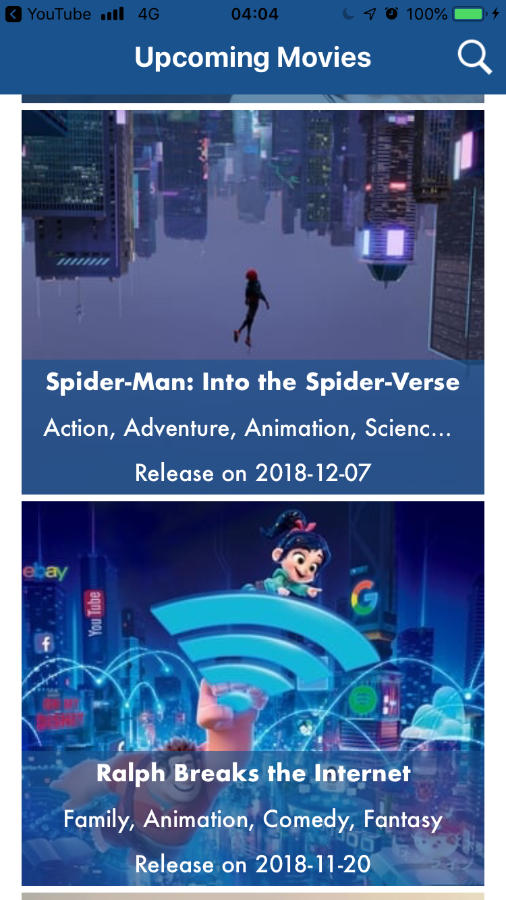

# CineApp
App feeded with content from The Movie Database (TMDb) 

# Build Instructions
- Pods are included.
- Before build, put your TMDB API Key (https://developers.themoviedb.org/3) in the "Suporting Files -> TheMovieDBApiKey.plist". Otherise, the app will crash

# Screenshots

# Third-party libraries

## Moya 
Library to create a struct to network access
- **Why?**
- - Is used to allow a simplest way to do URL requests using RxSwift to handle the responses
- **How?**
- - Using .rx to make requests

## Kingfisher
Library to download, cache and show images
- **Why?**
- - Kingfisher is an easy tool to fill images in the APP
- **How?**
- - All images in the app responded from the API are requested using this framework
